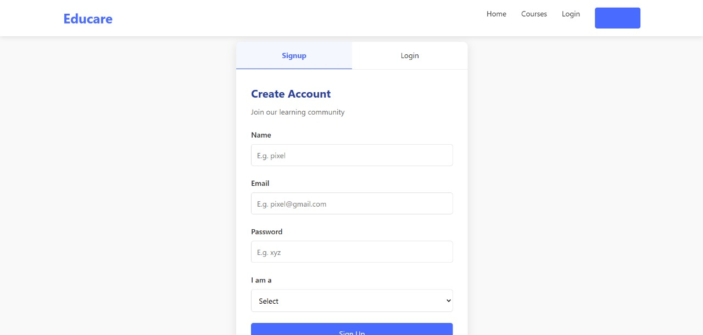
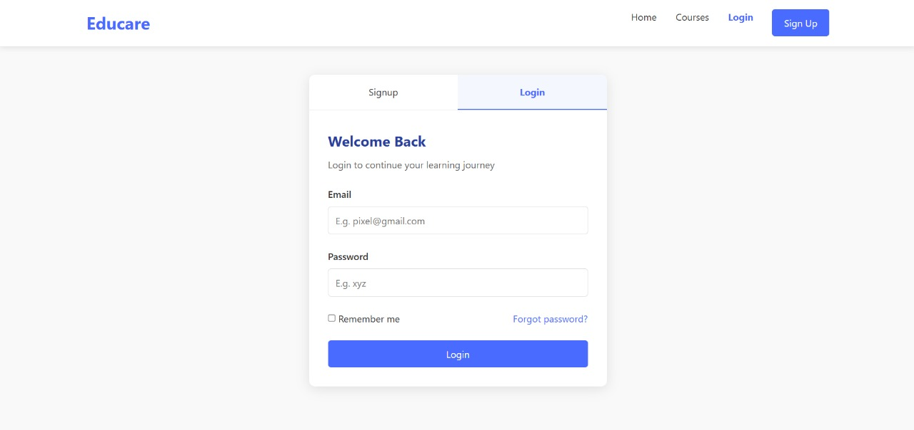
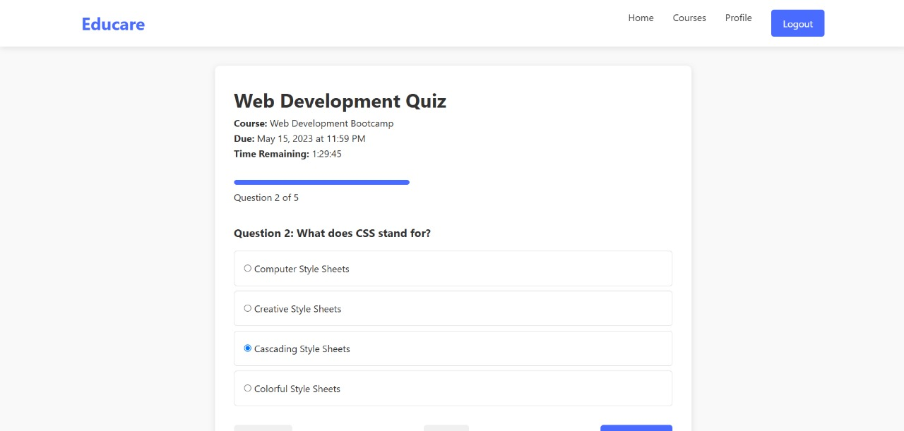
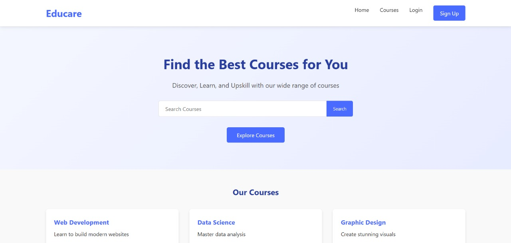
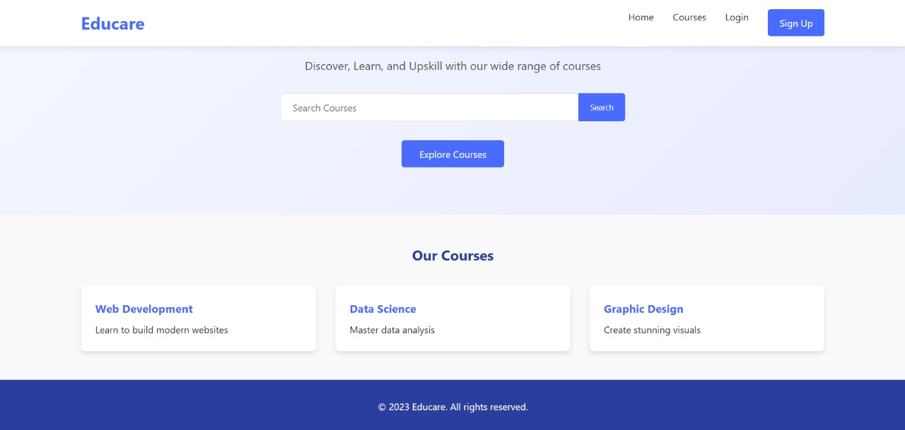
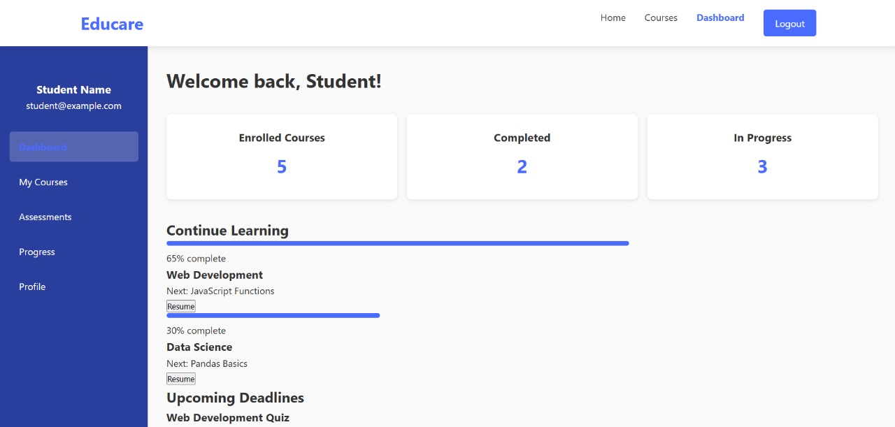
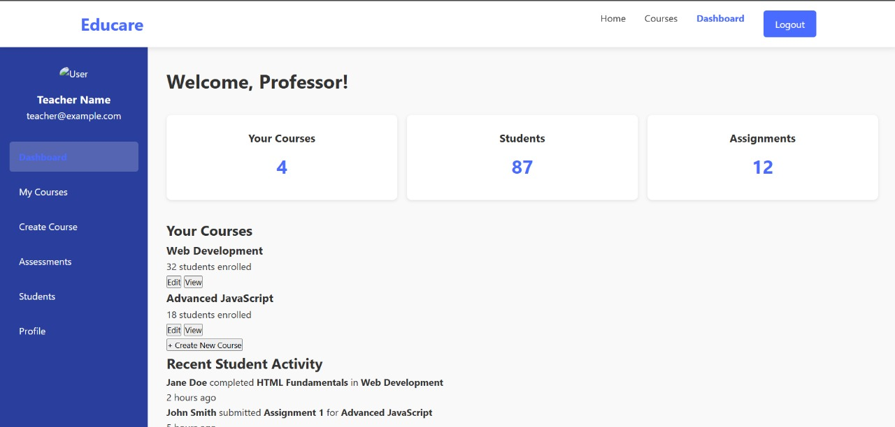
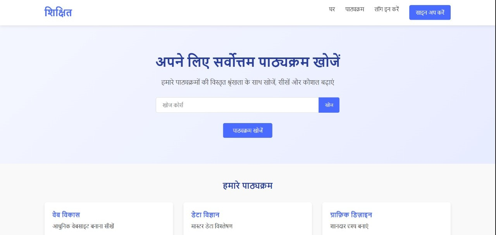

# EduCare

**EduCare** is a comprehensive educational management system aimed at enhancing the learning experience by providing tools for content delivery, user management, and administrative operations.

## 📌 Features

- **User Authentication**: Secure login and registration for students, teachers, and administrators.
- **Course Management**: Create, update, and manage courses and related materials.
- **Interactive Dashboard**: Personalized dashboards displaying relevant information and notifications.
- **Assignment Handling**: Upload, submit, and grade assignments with ease.
- **Communication Tools**: Integrated messaging system for seamless communication among users.

## 🛠️ Technologies Used

- **Frontend**: HTML, CSS, JavaScript
- **Backend**: Node.js, Express.js
- **Database**: MongoDB
- **Version Control**: Git & GitHub

## 🚀 Getting Started

### Prerequisites

- Node.js and npm installed
- MongoDB instance running

### Installation

1. **Clone the repository:**
   ```bash
   git clone https://github.com/KRISHNA-GOPALA/EduCare.git
   ```

2. **Setup Backend:**
   ```bash
   cd educare-backend
   npm install
   npm start
   ```
   
3. **Setup Frontend:**
   ```bash
   cd ../educare-frontend
   npm install
   npm start
   ```
   
4. **Access the Application:**
   Open your browser and navigate to http://localhost:3000

## Screenshots
1. **Signup Screen:**

   

2. **Login Screen:**

   

3. **Course Screen:**

   

4. **Quiz Assessment Screen:**

   

5. **Course Progress Screen:**

   

6. **Home Screen:**

   
   

8. **Student Dashboard Screen:**

   

9. **Teacher Dashboard Screen:**

   

10. **Profile Screen:**

   

11. **Linguistic Screen:**

   
